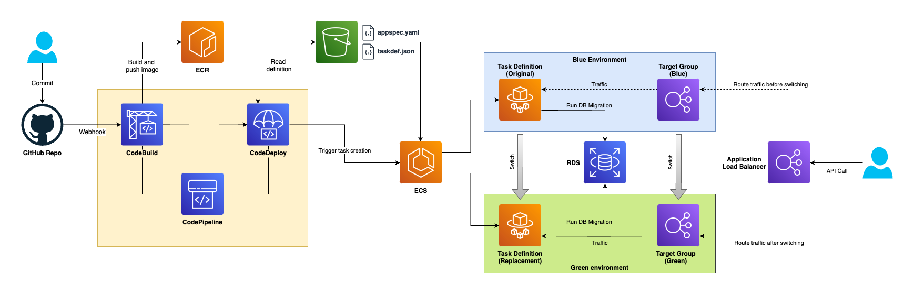

# Hello world application

Simple CRUD RESTful application written in python using Flask and SQLAlchemy ORM

Features:
- Runs locally using docker-compose
- Supports Database migrations
- Runs in AWS ECS with terraform configuration provided

Deployment design:

[](./docs/img/aws-blue-green.png)
<sup>[draw.io source](./docs/img/aws-blue-green.drawio)</sup>

## Installation

### Option 0: Running locally without using Docker (for debugging)

Before run, need to adjust database settings.

Open `.env` file and configure following variables:
```
PGHOST=<postgres database hostname / ip>
PGPORT=<postgres port>
PGUSER=<db user>
PGPASSWORD=<db password>
PGDATABASE=<db name>
```

Then, create virtualenv and install all required packages:

```
python3 -m venv venv
source venv/bin/activate
pip install -r requirements.txt
```

Run Flask application:

```
python hello_world/main.py
```

### Option 1: Run application locally using Docker

Requirements:
- docker
- docker-compose (or docker CLI with separate compose plugin installed)
- buildX kit installed

If compose installed separately:

```
docker-compose up -d
```

If compose installed as docker plugin:
```
docker compose up -d
```

> ⚠ **Pay attention**
> 
> Both, Flask and docker-compose use environment file `.env` for configuring database:
> - Docker uses `.env` file to create new database instance with provided credentials
> - Flask uses the same file to pass connection string to SQLAlchemy

### Option 3: Run application in AWS

This repository contains Terraform configuration which creates following AWS resources to run application:

- `VPC` with 2 public and 2 private subnets
- `RDS` with postgres database
- `ECR` service to store docker artifacts provided by CodeBuild
- `CodeBuild` service to build app *
- `ECS` Service to run application using Fargate
- `Application Load Balancer` to serve requests

#### Before installation need to adjust some variables

1. Obtain GitHub token required to configure integration between AWS CodeBuild and GitHub account with hosted repository:
   > https://docs.github.com/en/authentication/keeping-your-account-and-data-secure/managing-your-personal-access-tokens"
2. Create file `terraform/custom.auto.tfvars` and place token inside:
    ```
   github_personal_token = "<PERSONAL_ACCESS_TOKEN>"
   ```
3. If needed, other options, such repository address could be overwritten in `terraform/custom.auto.tfvars` file. This file is ignored by `.gitignore`. For list of all vars check `terraform/variables.tf`

#### Provision infrastructure

Requirements:
- Terraform >= 1.8.0

Init terraform and install all required providers

```
cd terraform
terraform init
```

Plan and apply configuration
```
terraform plan
terraform apply
```

All required resources will be created. At the end of installation the URL of the application will be provided.

> **All services created in dedicated VPC, no default resources are used. AWS Free tier compatible.**

#### Post installation steps

This solution requires one **manual step** at initial stage: is to run `CodeBuild` task manually to produce docker image.

1. Open `AWS Console` -> `CodeBuild`
2. Navigate `Build projects` page
2. Select `hello-world-build` project and click `Start build` button

When pipeline is finished, docker image with `:latest` tag will be pushed to ECR and picked up by ECS service called `hello-world-web` automatically. 

After some time try to navigate service url provided by terrafrom output (see Usage below), eg:
```"http://hello-world-alb-1009320411.us-east-1.elb.amazonaws.com/hello"```

## Usage

At first start up application executes SQL migrations, which seed database with required table(s).

When application is ready (no errors occured), we are able to add new user:
```
curl -vvv -X PUT -d '{"dateOfBirth": "2024-05-28"}' -H "Content-Type: application/json" http://localhost:5000/hello/vasya
```

To retrieve information about user, run:
```
curl http://localhost:5000/hello/vasya
```

Only letters allowed in username. If wrong data provided, corresponding code will be returned in response
